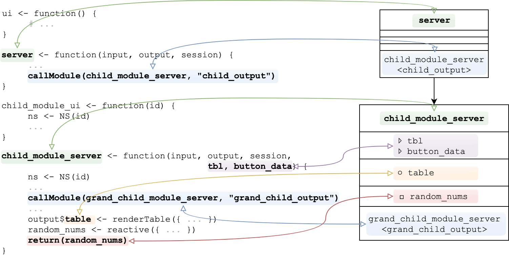

---
output:
  github_document:
    fig_width: 4
    fig_height: 1
always_allow_html: yes
---

<!-- README.md is generated from README.Rmd. Please edit that file -->

```{r setup, include = FALSE}
knitr::opts_chunk$set(
  collapse = TRUE,
  comment = "#>",
  fig.path = "man/figures/README-",
  out.width = "100%"
)
```

# supreme <a href='https://github.com/strboul/supreme/'></a>

[](https://github.com/strboul/supreme) [](https://travis-ci.org/strboul/supreme) [](https://ci.appveyor.com/project/strboul/supreme) [](https://codecov.io/github/strboul/supreme?branch=master)

*supreme* is a modeling tool helping you better structure Shiny applications
developed with modules

Therefore, you are able to:

1. **Visualize** relationship of modules in *existing applications*

1. **Design** *new applications* from scratch

## Installation

```{r, eval=FALSE}
# install.packages("devtools")
devtools::install_github("strboul/supreme")
```

## Usage

### Existing applications

For your existing application, you can use `src_file()` call that reads your application from files.

*supreme* package comes with an example path containing a dummy Shiny application
created with modules for testing issues.

After the application has been read, create a *supreme* object from the read model object:

```{r}
library(supreme)
path <- example_app_path()
obj <- supreme(src_file(path))
obj
```

If you want to run *supreme* on your application that is stored in a different format (as a package, environment etc.), please see the `?src_file` documentation page that has information about the other options to read your application as *supreme* source model objects.

See the generated *supreme* object in tabular form (as `data.frame` or `tibble`):

```{r}
df <- as.data.frame(obj)
tbbl <- tibble::as_tibble(df)
tbbl
```

Visualize the module structure:

```{r supreme-graph-example}
graph(obj)
```

<br>

### Creating YAML model objects

Model definition with *YAML* is a handy to design a new application from scratch or 
just design the specific parts of applications. Planning ahead with model tool can 
really be beneficial before going wild on implementation.

```{r, echo=FALSE, results='asis'}
model <- "
- type: module
  name: server
  calling_modules: 
    - items_tab_module_server
    - customers_tab_module_server:
      - customers_tab_ui
    - transactions_tab_module_server
    
- type: module
  name: items_tab_module_server
  input: 
    - items_list
    - is_fired
  src: inventory
  
- type: module
  name: customers_tab_module_server
  input: customers_list
  output: 
    - paid_customers_table
    - free_customers_table
  src: sales
    
- type: module
  name: transactions_tab_module_server
  input: 
    - table
    - button_clicked
  output: transactions_table
  return: transactions_keys
  src: sales
"
cat(sprintf("```yaml%s```\n", model))
```

```{r}
library(supreme)
model_yaml <- src_yaml(text = model)
obj <- supreme(model_yaml)
tibble::as_tibble(as.data.frame(obj))
```

There are some special rules when creating model objects with *YAML*: 

+ Each entity in the model must have 
  `r mmy::list_en_end(paste0("*", getOption("SUPREME_MODEL_REQUIRED_FIELDS"), "*"))` 
  fields.

+ The entities can have optional fields, which are
  `r mmy::list_en_end(paste0("*", getOption("SUPREME_MODEL_OPTIONAL_FIELDS"), "*"))`.

+ The fields 
  `r mmy::list_en_end(paste0("*", getOption("SUPREME_MODEL_MULTI_VAR_FIELDS"), "*"))`
  can have mutliple elements. The others can only have a single element.

Any other field, which is not known by the supreme modal object 
(like a `shape: star`), added to the model
definition is not allowed and it will throw an error.

Finally, we can visualize the supreme mode object we created above from *YAML* model:
```{r yaml-graph}
graph(obj)
```

See the next session to understand how this [model language](#model language) works.

### The model language

A *supreme* object is consisted by *entities*. An *"entity"* denotes here that a Shiny
server component is allowed to either be a server side of a module or the main `server`
function of a Shiny application.

<br/>

```{r out-diagram, echo=FALSE, out.width='90%', fig.align='center'}

```

<br/>

A graph entity consists of five main fields:

1. Module name

2. Module inputs (except the defaults *input*, *output*, *session*)

3. Module outputs

3. Return from the module

4. Modules called by the module

## Current limitations

+ Although it's possible to create a Shiny application by only providing `input` and `output`
arguments in the server side, *supreme* will not read any Shiny server side component
missing a `session` argument. That's reasonable decision because modules cannot work without `session` argument and
supreme is a package designed to work with Shiny modules.

+ *supreme* will not properly parse the source code of your application if server
side component is created with `shinyServer()`, which is kind of soft-deprecated
after a very early Shiny version `0.10`.

+ Some idiosyncratic Shiny application code may not be parsed as intended. For such cases,
it would be great if you open an issue describing the situation with a reproducible example.

## Acknowledgements

+ [R Core Team](https://www.r-project.org/): 
  *supreme* package is brought to life thanks to *R* allowing *abstract
  syntax trees* (AST) that is used to practice static analysis on the code.

+ [datamodelr](https://github.com/bergant/datamodelr): 
  Inspiring work for creating modelling language

+ [shinypod](https://github.com/ijlyttle/shinypod):
  Interesting thoughts regarding the implementation of Shiny modules

## License

MIT &#169; Metin Yazici

