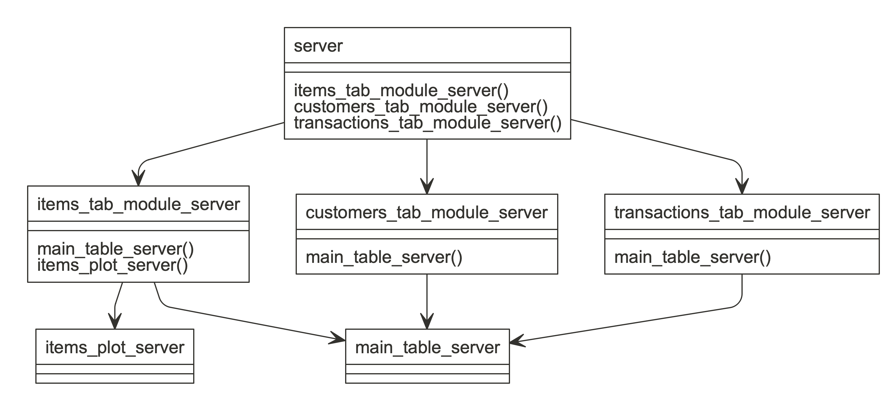

<!-- README.md is generated from README.Rmd. Please edit that file -->

# supreme

[](https://github.com/strboul/supreme)
[](https://travis-ci.org/strboul/supreme)
[](https://ci.appveyor.com/project/strboul/supreme)
[](https://codecov.io/github/strboul/supreme?branch=master)

*supreme* helps you structure your Shiny application developed with
modules

You are be able to:

  - Model and visualize your existing application or design a new one
    from scratch

  - Keep track of your modules that are either placed in the different
    parts or reused in multiple places in your existing application

## Installation

``` r
devtools::install_github("strboul/supreme")
```

## Usage

Create a supreme object from a file:

``` r
library(supreme)
path <- example_app_path()
obj <- supreme(src_file(path))
obj
#> A supreme model object
#> 6 entities: server, customers_tab_module_server, items_tab_module_server, items_plot_server, ...
```

Visualize the module structure:

``` r
graph(obj)
```



<br>

See the generated *supreme* object in tabular form (as `data.frame` or
`tibble`):

``` r
df <- as.data.frame(obj)
tbbl <- tibble::as_tibble(df)
tbbl
#> # A tibble: 6 x 6
#>   type   name       input output calling_modules           src             
#>   <chr>  <chr>      <chr> <chr>  <chr>                     <chr>           
#> 1 module server     <NA>  <NA>   items_tab_module_server,… /Users/metin/Li…
#> 2 module customers… <NA>  <NA>   main_table_server         /Users/metin/Li…
#> 3 module items_tab… <NA>  <NA>   main_table_server, items… /Users/metin/Li…
#> 4 module items_plo… <NA>  <NA>   <NA>                      /Users/metin/Li…
#> 5 module transacti… <NA>  <NA>   main_table_server         /Users/metin/Li…
#> 6 module main_tabl… <NA>  <NA>   <NA>                      /Users/metin/Li…
```

## Read more

The following vignettes contain more detailed information about how to
use *supreme* in different ways.

*(they’re under development)*

  - [**Getting started with
    supreme**](https://strboul.github.io/supreme/articles/getting-started.html)

  - [**Visualize ‘supreme’
    objects**](https://strboul.github.io/supreme/articles/visualize-supreme-objects.html)

## Contribution

This package is still on progress. **API is subject to change.**

PRs and issues are much appreciated.

## Acknowledgements

  - *supreme* does a static analysis on the code thanks to *R* allowing
    to manipulate *abstract syntax trees* (AST) easily.

  - [datamodelr](https://github.com/bergant/datamodelr)

## License

GPL-2.0
