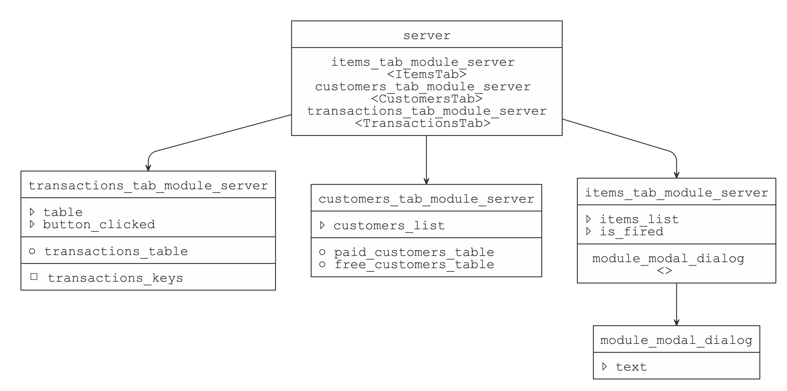

<!-- README.md is generated from README.Rmd. Please edit that file -->

# supreme <a href='https://github.com/strboul/supreme/'></a>

<!-- badges: start -->

[](https://travis-ci.org/strboul/supreme)
[](https://ci.appveyor.com/project/strboul/supreme)
[](https://cran.r-project.org/package=supreme)
[](https://www.r-pkg.org/pkg/supreme)
[](https://codecov.io/github/strboul/supreme?branch=master)
<!-- badges: end -->

As a ‘[Shiny](https://shiny.rstudio.com/) application’, developed with
‘[Shiny modules](https://shiny.rstudio.com/articles/modules.html)’,
gets bigger, it becomes more difficult to track the relationships and to
have a clear overview of the module hierarchy. supreme is a tool to help
developers visualize the structure of their ‘Shiny applications’
developed with modules.

Therefore, you are able to:

1.  **Visualize** relationship of modules in *existing applications*

2.  **Design** *new applications* from scratch

## Usage

### 0\. The model language

<p align="center">


</p>

A graph consists of five main fields:

1.  Module name (always required)

2.  Module inputs (except the defaults: *input*, *output*, *session*)

3.  Module outputs

4.  Module returns

5.  Calling modules, which are modules called a the module

### 1\. Model graph for existing applications

``` r
library(supreme)
path <- example_app_path()
obj <- supreme(src_file(path))
graph(obj)
```



<br>

### 2\. Model new applications

``` yaml
- name: server
  calling_modules:
    - items_tab_module_server: ItemsTab
    - customers_tab_module_server: CustomersTab
    - transactions_tab_module_server: TransactionsTab
  src: app.R

- name: customers_tab_module_server
  input: customers_list
  output:
    - paid_customers_table
    - free_customers_table
  src: module-customers.R

- name: items_tab_module_server
  input:
    - items_list
    - is_fired
  calling_modules:
    - module_modal_dialog: ~
  src: module-items.R

- name: transactions_tab_module_server
  input:
    - table
    - button_clicked
  output: transactions_table
  return: transactions_keys
  src: module-transactions.R

- name: module_modal_dialog
  input:
    - text
  src: module-utils.R
```

There are some special rules when creating model objects with *YAML*:

  - Each entity in the model must have a *name* field.

  - The entities can have optional fields, which are defined in the
    `getOption("SUPREME_MODEL_OPTIONAL_FIELDS")`

  - The fields defined in the
    `getOption("SUPREME_MODEL_MULTI_VAR_FIELDS")` can have multiple
    elements. It means that these fields can be expressed as an array.

<!-- end list -->

``` r
model_yaml <- src_yaml(text = model)
obj <- supreme(model_yaml)
```

## Known limitations

  - *supreme* will not properly parse the source code of your
    application if server side component is created with
    `shinyServer()`, which is soft-deprecated after a very early Shiny
    version of `0.10`.

  - Similarly, although it’s possible to create a Shiny application by
    only providing `input` and `output` arguments in the server side,
    *supreme* will not read any Shiny server side component missing a
    `session` argument. That’s reasonable decision because modules
    cannot work without a `session` argument.

  - For the module returns, all return values in a module should
    explicitly be wrapped in `return()` calls.

  - All the possible limitations comes from the fact that supreme is
    designed to perform static analysis on your code. Thus, some
    idiosyncratic Shiny application code may not be parsed as intended.
    For such cases, it would be great if you open an issue describing
    the situation with a reproducible example.

## Installation

You can install the released version from
[CRAN](https://cran.r-project.org/package=supreme):

``` r
install.packages("supreme")
```

Or get the development version from
[GitHub](https://github.com/strboul/supreme):

``` r
# install.packages("devtools")
devtools::install_github("strboul/supreme")
```

## Acknowledgment

  - [R Core Team](https://www.r-project.org/): *supreme* package is
    brought to life thanks to *R* allowing *abstract syntax trees* (AST)
    that is used to practice static analysis on the code.

  - [datamodelr](https://github.com/bergant/datamodelr): Inspiring work
    for creating modeling language

  - [shinypod](https://github.com/ijlyttle/shinypod): Interesting
    thoughts regarding the implementation of Shiny modules

## License

MIT © Metin Yazici
